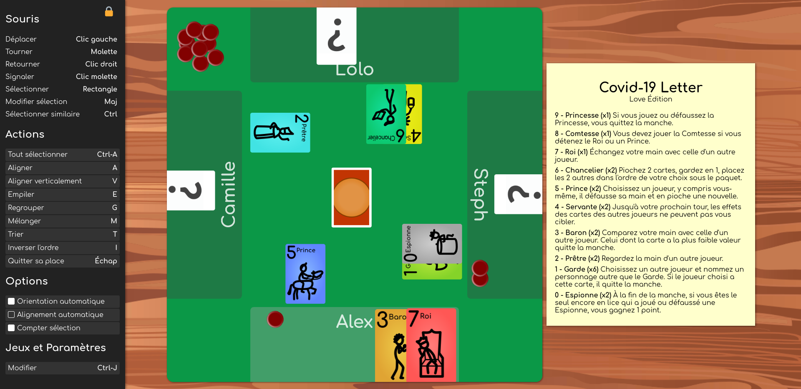

Covid Card Table
================

A real-time virtual multiplayer game table to play card games.

Overview
--------

Enjoy playing card games with friends over the Internet!
Handle your cards as you would do in real life.



Powered by [Lance.gg](http://lance.gg/) and [PixiJS](https://www.pixijs.com/).

Install and Run
---------------

Install with:
```bash
npm install
```
Then, run with:
```bash
PORT=2999 npm start
```
or using the default port value (2999):
```bash
npm start
```

Finally, load http://localhost:2999 in your web browser.

How to Add a Card Set
---------------------

1. Choose a unique prefix
   * for the example: `"classic"`
1. Add one or more images that gathers multiple cards in [dist/assets/](dist/assets/)
   * examples: [dist/assets/classic1.png](dist/assets/classic1.png), [dist/assets/classic2.png](dist/assets/classic2.png)
   * due to a WebGL restriction, __the images must not exceed 1024x1024 pixels__
1. For each image, add a json file that describes the size and the position of the cards, in [dist/assets/](dist/assets/)
   * examples: [dist/assets/classic1.json](dist/assets/classic1.json), [dist/assets/classic2.json](dist/assets/classic2.json)
   * a card name must follow the pattern `"{prefix}-{id}.png"`, with id from 0 to number of cards - 1
   * there are 3 special card names: `"{prefix}-back.png"`, `"{prefix}-unknown.png"` and, `"{prefix}-unknown\_back.png"`, for the images of the back side, the front side when the card is hidden and, the back side when the card is hidden (respectively). Only required for cards.
1. Declare your new resource in [src/data/catalog.json](src/data/catalog.json)
   * add an entry in the list named `"resources"`:
     ```javascript
     "resources": [
       ..., // other resources
       {
            "name": "classic",               // same as prefix
            "files": ["assets/classic1.json", "assets/classic2.json"], // json files created previously
            "type": "card",                  // or "item"; cards are flippable and orientable, items are not
            "count": 55,                     // number of cards or items
            "size": {"x": 120, "y": 180},    // size of a card
            "align_step": {"x": 28, "y": 32} // step in pixels when aligning card horizontally (x) or vertically (y)
       }
     ]
     ```
1. (Optional) Add a description for each card, to be displayed as a tooltip on mouse over
   * Add a json file in [src/data/](src/data/) named `"{prefix}-desc.json"` a list of strings for text/html description of each card:
     ```javascript
     [
       "<i>Description</i> for card with <b>id=0</b>",
       "<i>Description</i> for card with <b>id=1</b>",
       "<i>Description</i> for card with <b>id=2</b>",
       ...
     ]
     ```
   * Load the description in [src/data/Catalog.js](src/data/Catalog.js), append the line:
     ```javascript
     Catalog.getResourceByName("{prefix}").descriptions = require('../../src/data/{prefix}-desc.json');
     ```

How to Create a Game Set That Uses a Card Set
-----------------------------------------

1. Choose a unique game name:
   * for the example: `"my-game"`
1. Declare a game set that includes the new cards in [src/data/catalog.json](src/data/catalog.json):
   * add an entry in the object named `"games"`
     ```javascript
     "games": {
       ..., // other games
       "my-game": {                                    // Unique game name
         "name": "My Name",                          // More human game name
         "description": "This is a game description.", // Short game description
         "ids": {
           "classic": [ // resource name from which to include objects
             0,      // add 1 copy of the object with id=0;       pattern: {id} or "{id}"
             "0x4",  // add 4 copy of the object with id=0;       pattern: "{id}x{count}"
             "1-3",  // add 1 copy of the objects with id=1,2,3;  pattern: "{first_id}-{last_id}"
             "1-3x4" // add 4 copy of the objects with id=1,2,3;  pattern: "{first_id}-{last_id}x{count}"
           ],
           "token": [ // you may include objects from an other resource
             "3x5", "7x5", 12
           ]
         }
       }
     }
     ```
1. (Optional) Write a rule summary in html, stored in a json file (array of string of html code):
   * Add a json file in [src/data/](src/data/) named `"my-game-html.json"`
     ```javascript
     [
       "<h1>My game</h1>",
       "<p>If you know about this game, <b>you must play</b>.",
       "If you think about this game, <b>you lose</b>.",
       "If you lose, you must say <i>\"I lost!\"</i> loudly.</p>",
       ...
     ]
     ```
   * Load the rule summary in [src/data/Catalog.js](src/data/Catalog.js), append the line:
     ```javascript
     Catalog.games["my-game"].html = require('../../src/data/my-game-html.json').join('\n');
     ```
1. The new game now appears in the list of available games in the "Games and Parameters" window (open with Ctrl+J).
